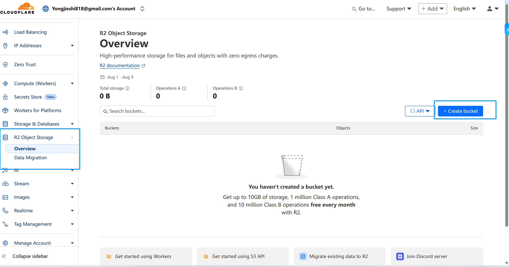
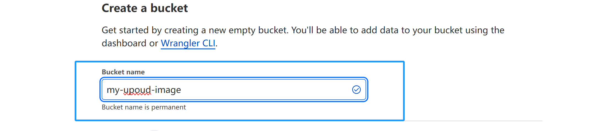
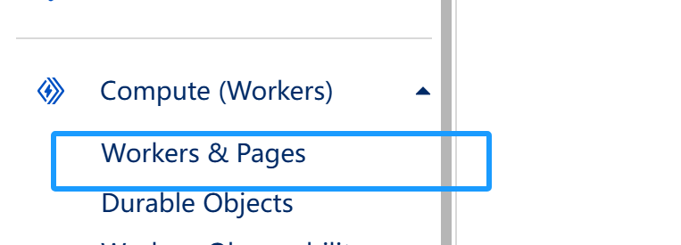
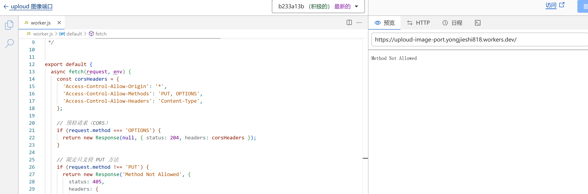
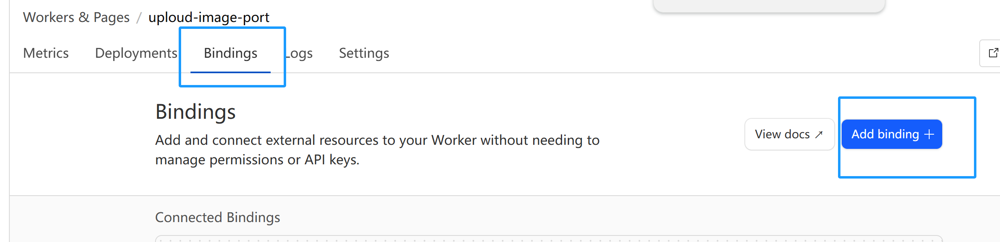
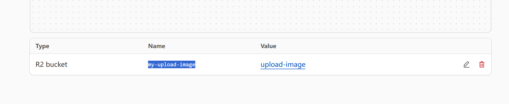

---

## ⚙️ 部署步骤

### 1. 创建 R2 存储桶

在 Cloudflare Dashboard 中：
1. 打开 **R2** → 创建一个存储桶（Bucket）
2. 记录下存储桶名称，例如：`my-upoud-image`


---

### 2. 创建 Worker 并绑定 R2

1. 打开 **Workers & Pages** → **Create Worker**
2. 将 `worker.js` 代码粘贴到在线编辑器  
3. 在 Worker 设置中找到 **Settings → Bindings → R2 bucket bindings**
4. 添加 R2 绑定：
   - **Variable name**: `my-upoud-image` （代码中用到的 env 名称）
   - **Bucket name**: 选择你的 R2 存储桶
5. 点击 **Deploy** 发布 Worker

---

### 3. 代码说明

```javascript
await env["my-upoud-image"].put(objectName, body, {
  httpMetadata: { contentType },
});

env["my-upoud-image"] 是绑定的 R2 存储桶(key)
objectName 是文件在 R2 中的路径/名称
body 是文件数据
contentType 是文件 MIME 类型

该 Worker 默认允许任意域名访问：
js
const corsHeaders = {
  'Access-Control-Allow-Origin': '*',
  'Access-Control-Allow-Methods': 'PUT, OPTIONS',
  'Access-Control-Allow-Headers': 'Content-Type',
};